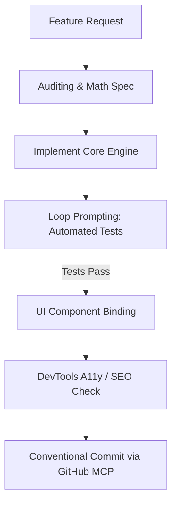

# Feature Development Workflow

## Step 1: Spec & Mathematical Model
Define inputs, chemical volatile profiles, sensory coordinates, or economic
formulas before touching any user-facing templates.

## Step 2: Test-Driven Loop
1. Write isolated unit test in `tests/`.
2. Run test script via Node runner.
3. If errors occur, analyze log, correct code, and re-run until 100% green.

## Step 3: UI & A11y Verification
Bind to DOM using semantic elements. Verify keyboard events (`Enter`, `Space`,
`Esc`, `Ctrl+K`), ARIA roles, and color contrast.

## Step 4: Version Control
Commit changes using Conventional Commits (`feat:`, `fix:`, `docs:`) and push
through GitHub MCP.
